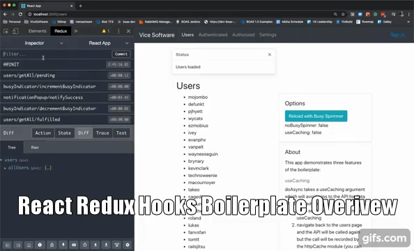
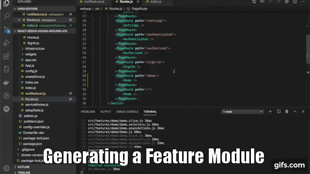
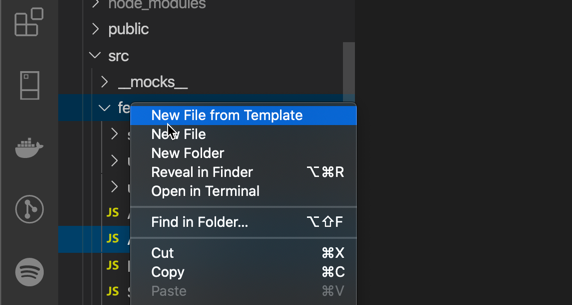
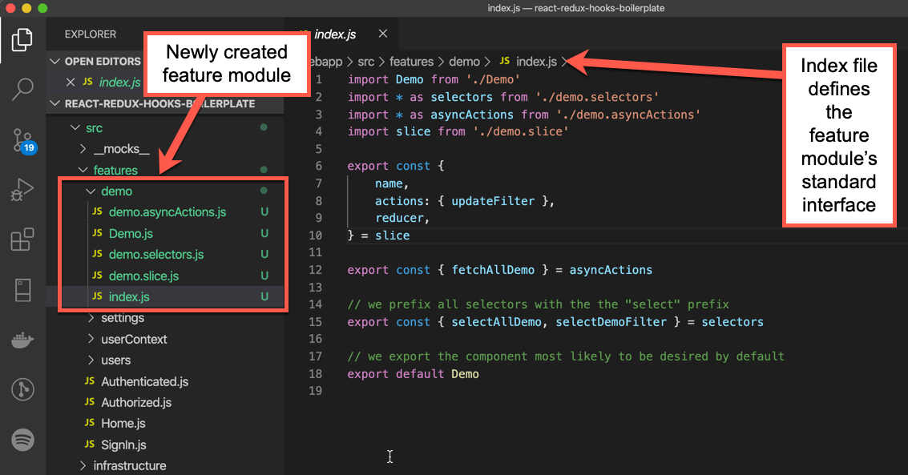
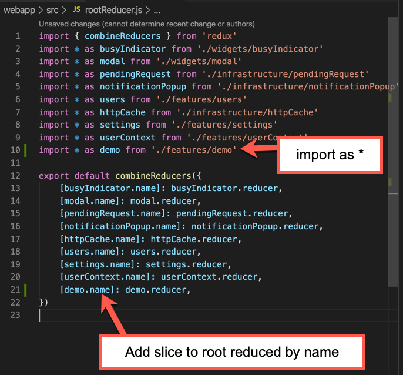
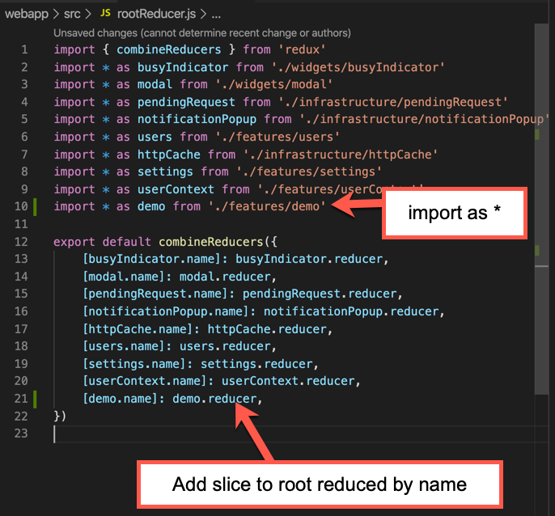

<!-- TOC -->

- [Overview](#overview)
    - [Overview Video](#overview-video)
- [Installation and Running](#installation-and-running)
    - [Available Scripts](#available-scripts)
        - [`npm start`](#npm-start)
        - [`npm test`](#npm-test)
        - [`npm run build`](#npm-run-build)
        - [`npm run eject`](#npm-run-eject)
        - [Docker Support](#docker-support)
- [Goals](#goals)
    - [Good Starting Point](#good-starting-point)
    - [High Developer Ergonomics](#high-developer-ergonomics)
    - [Create Software with High Asset Value](#create-software-with-high-asset-value)
    - [Maximize the Value of the Tools we are Using](#maximize-the-value-of-the-tools-we-are-using)
    - [Scale Well in Complex Apps](#scale-well-in-complex-apps)
- [Features](#features)
    - [Feature Module Generation in VS Code](#feature-module-generation-in-vs-code)
    - [Authentication Flow with Redux](#authentication-flow-with-redux)
    - [Permission Based Authorization with Redux](#permission-based-authorization-with-redux)
    - [Redux Caching](#redux-caching)
    - [Background Loading](#background-loading)
    - [Busy Indicator with Redux](#busy-indicator-with-redux)
    - [Automatic Linting and Code Beutification](#automatic-linting-and-code-beutification)
    - [Circular Dependency Detection](#circular-dependency-detection)
- [Folder Structure](#folder-structure)
- [Patterns](#patterns)
    - [Feature Module Pattern](#feature-module-pattern)
        - [Module Structure](#module-structure)
            - [index.js](#indexjs)
                - [name](#name)
                - [reducer](#reducer)
                - [actions](#actions)
                - [asyncActions](#asyncactions)
                - [selectors](#selectors)
- [Infrastructure Components](#infrastructure-components)
    - [doAsync](#doasync)
        - [Options](#options)
    - [busyIndicator](#busyindicator)
    - [withRestrictedAccess](#withrestrictedaccess)
        - [Authenticated Component](#authenticated-component)
        - [Authorized Comopnent](#authorized-comopnent)
    - [popupNotification](#popupnotification)
- [Best Practices](#best-practices)
    - [Only access redux state in selectors](#only-access-redux-state-in-selectors)
    - [Always collocate selectors with reducers](#always-collocate-selectors-with-reducers)
- [Configuration](#configuration)
    - [API Proxy](#api-proxy)
- [Learn More](#learn-more)
    - [Code Splitting](#code-splitting)
    - [Analyzing the Bundle Size](#analyzing-the-bundle-size)
    - [Making a Progressive Web App](#making-a-progressive-web-app)
    - [Advanced Configuration](#advanced-configuration)
    - [Deployment](#deployment)
    - [`npm run build` fails to minify](#npm-run-build-fails-to-minify)

<!-- /TOC -->

# Overview
This is a React boilerplate focused on enabling high developer velocity while implementing idiomatic Redux Hooks and React Hooks.

## Overview Video
Here's a video that walks through some of the major features of this boilerplate.

[](https://www.youtube.com/watch?v=4l9KUffb9cc)

# Installation and Running

This project was bootstrapped with [Create React App](https://github.com/facebook/create-react-app).

## Available Scripts

Note that the app supports docker for projects that want to use micorservices. Because of this the Web Application is in the `webApp` folder.

---
**IMPORTANT**

All of the commands below require you to be in the `webApp` directory

---

### `npm start`

- Runs the app in the development mode.
- Open [http://localhost:3000](http://localhost:3000) to view it in the browser.
- The page will reload if you make edits.<br />
- Prettier will run and auto-format your code whenever a file is saved.
- You will also see any lint errors in the console.
  - *Currently lint errors get written out twice. We will try and fix this soon.*

### `npm test`

- Launches the test runner in the interactive watch mode.
- See the section about [running tests](https://facebook.github.io/create-react-app/docs/running-tests) for more information.

> **_NOTE_** 
>
> You must place `node-module` mocks in the `webapp/src/__mocks__` director because `create-react-app` reset Jest's `roots` config for performance reasons. I lost half a day on figuring this out so figured I'd share. The PR is below.
>
> https://github.com/facebook/create-react-app/pull/7480/files


### `npm run build`

- Builds the app for production to the `build` folder.
- It correctly bundles React in production mode and optimizes the build for the best performance.
- The build is minified and the filenames include the hashes.
- Your app is ready to be deployed!
- See the section about [deployment](https://facebook.github.io/create-react-app/docs/deployment) for more information.

### `npm run eject`

> **_NOTE_** 
>
> This is a one-way operation. Once you `eject`, you can’t go back!**

If you aren’t satisfied with the build tool and configuration choices, you can `eject` at any time. This command will remove the single build dependency from your project.

Instead, it will copy all the configuration files and the transitive dependencies (webpack, Babel, ESLint, etc) right into your project so you have full control over them. All of the commands except `eject` will still work, but they will point to the copied scripts so you can tweak them. At this point you’re on your own.

You don’t have to ever use `eject`. The curated feature set is suitable for small and middle deployments, and you shouldn’t feel obligated to use this feature. However we understand that this tool wouldn’t be useful if you couldn’t customize it when you are ready for it.

### Docker Support
To run the Web Application in a docker container from the root directory execute the command below.

```
docker-compose up
```

The code running in the container uses a mapped volume and will have all the same features as when you run `npm start` from `webApp` directory (file watching for prettier, rebuild, etc...). The main difference is that you won't get as pretty formatted output (no colors, etc...) and you won't be able to click on the source code paths to jump to the file.

# Goals
These are the goals of this boilerplate

## Good Starting Point
We don't want to waste time or our clients budgets rewriting the same code over and over for things every web app needs like 

- authentication
- authorization
- popups (errors, notifications)
- busy indicators
- caching
- forms and validations
- ect...

## High Developer Ergonomics
We want to make sure that  
- developers are able to do the 80% they need to do most often easily without a lot of boilerplate
- new developers on the project can get up and running quickly and modify the code confidently

## Create Software with High Asset Value
It's much easier to create software that is a liability, that offers little value to the sponsors without the team that wrote it. We want the systems built with this boilerplate to be easy to transfer from one team to another. We often help clients to build apps that their own teams will take over one day and want that transfer to be as easy as possible.

## Maximize the Value of the Tools we are Using
We don't want to include libraries because they are popular, we want to include them because they add value that we want to take advantage of. So for example if we are using Redux then we want to take advantage of the valuable features it provide (dev tooling, serializable state, etc...).

## Scale Well in Complex Apps
We want to make sure that if the projects that use this boilerplate become successful and complex overtime that they won't outgrow the patterns, infrastructure and best practices.

# Features
Below are some of the features that we've added to this boilerplate

## Feature Module Generation in VS Code
Our architecture uses a pattern we call [Feature Module](#feature-module-pattern) and we have added a blueprint template that will allow generating a working `Feature Module` from the context menu. [The video below](https://www.youtube.com/watch?v=Aoz6VPHQr-4&t=6s) walks through quickly creating a feature using this approach.

[](https://www.youtube.com/watch?v=Aoz6VPHQr-4&t=6s)

To take advanatage of this feature you need to use Visual Studio Code with the [Blueprint Templates](https://marketplace.visualstudio.com/items?itemName=teamchilla.blueprint) plugin. Once you have Blueprint installed then you can simply:

1. Right click on a folder

    

1. Select the `Feature Module` template

    

1. Enter the name of your new feature

    

Now you will have a new feature module created like the one showed below.




## Authentication Flow with Redux
We provide a login flow that you can plug in Auth0 or whatever IDP you like to use. Our authentication flow will allow you to call your IDP and handles redirecting from protected routes to Sign In page for you as well as redirecting back to the calling page after successful sign in. The user profile returned from your IDP will be put into redux and available on the `state.userContext` slice.


> **_NOTE_**
>
> You can watch a video demonstrating this feature in the [Overview Video](#overview-video) section.

## Permission Based Authorization with Redux
We have added `withRestrictedAccess(component, permissions)` HOC which takes `permissions` array that will be cross referenced with `state.userContext.permissions` automatically and prevent access for users without the configured permissions.

> **_NOTE_**
>
> You can watch a video demonstrating this feature in the [Overview Video](#overview-video) section.

## Redux Caching
Via the `doAsync` module that can be easily used with `createAsyncThunk` from `redux-toolkit` we support redux caching. Passing `useCaching: true` to `doAsync({url, useCaching: true})` will not go to the server if the data has already been fetched and is in redux. 

> **_NOTE_**
>
> You can watch a video demonstrating this feature in the [Overview Video](#overview-video) section.

## Background Loading
Via the `doAsync` module that can be easily used with `createAsyncThunk` from `redux-toolkit` we support background loading of data via API calls. Passing `noBusySpinner: true` to `doAsync({url, noBusySpinner: true})` will start a call to the API but not turn on the busy indicator. Note that if a call comes through for the same url before the first background call returns then the busy spinner will be turned on and the API will not be called and the current request will not be sent to the API.

> **_NOTE_**
>
> You can watch a video demonstrating this feature in the [Overview Video](#overview-video) section.

## Busy Indicator with Redux
The `busyIndicator` module allows for redux based busy indicator management. Our `doAsync` module will automoatically turn on and off the busy indicator for you as you call the API. You can also manually turn on and off the busy indicator and there is support for named busy indicators allowing for creating regional busy indicators. 

> **_NOTE_**
>
> You can watch a video demonstrating this feature in the [Overview Video](#overview-video) section.

## Automatic Linting and Code Beutification
Every time a file is saved when the app is running in dev via `npm start` that file will be beautified via prettier and the prettier rules have been configured to match the eslint rules.

## Circular Dependency Detection
If you introduce a circular dependency in your `import` statements the build will fail and you will be forced to fix it by refactoring your code. If circular references aren't fixed you will eventually get a very hard to fix `object null` null type of exception. This usually happens after there are a lot of circular references in the code making cleaning all up difficult and expensive.

# Folder Structure
We are using the folder structure described below.

- `webapp`: contains the web app source
   - `features`: one folder for each app feature (userProfile, orders, accounts, etc...)
   - `infrastructure`: contains code that is a cross cutting concern but not a component (httpCache, doAsync, etc...)
   - `widgets`: contains reusable UI widgets (NavBar, Modal, NotificationPopup, etc...)


# Patterns
Below are patterns we use and best practices we recommend.

## Feature Module Pattern
The feature module pattern is the pattern we recommend for organizing a feature in the application where a feature is a set of functionality that uses one or more Redux reducer slices. Basically, this means any feature of your app that uses redux. This could be a widget like a busy indicator or a domain specific feature like a document list. You can easily create feature modules using the technique described in the [Feature Module Generation in VS Code](#feature-module-generation-in-vs-code) secont above.

> **_NOTE_**
>
> You can watch a video on generating a Feature Module in the [Feature Module Generation in VS Code](#feature-module-generation-in-vs-code) section.

### Module Structure
A feature module is designed to be contained using the module approach found in node JS. We can thinkg of each features as being a self contained node module. It's desirable that if you write a component that could be used in another project that you could easily move the files over to the new project and using this organization will give you that benifit. Each module is made up of a folder with the following files.

```
- demo
-- index.js
-- demo.slice.js
-- demo.asyncActions.js
-- demo.selectors.js
-- Demo.js
```

> **_NOTE_** 
>
> Not all files are required in all cases


#### index.js
This file defines the public interface of the module and allows us to be explicity about how it should be used. 

> **_NOTE_** 
>
> In Javascript it's possible for anyone to `import` any file so the goal here is to express intent not to prevent misuse.


Every `export` in this file is something that you can easily import else where in the system. The structure of this file is

```javascript
import Demo from './Demo'
import * as selectors from './demo.selectors'
import * as asyncActions from './demo.asyncActions'
import slice from './demo.slice'

export const {
	name,
	actions: { updateFilter },
	reducer,
} = slice

export const { fetchAllDemo } = asyncActions

// we prefix all selectors with the the "select" prefix
export const { selectAllDemo, selectDemoFilter } = selectors

// we export the component most likely to be desired by default
export default Demo
```

> **_NOTE_** 
>
> We are using `redux-toolkit` and they recommend following an approach called `dux` where you put all your actions and selectors and other data flow code in a a single file. We are not following that here. Instead we have put `./module-name.selectors.js` and `./module-name.asyncActions.js` in seperate files and this is because we find these get large over time in complex systems. `redux-toolkit` is being responsive to it's users complaints about having to modify too many files when they make changes but we feel that the benifits in a large system out weigh this concern.

**Exports**

What we are exporting is:

##### name

This is available to consumers and should be used as the name of the slice on the root reducer as shown below:



---
> **_NOTE_** 
>
> The name is part of the slice created by `redux-toolkit`'s `createSlice()` builder function.

##### reducer
This is available to consumers and should be used as the reducer for this module and mounted to the root reducer:



> **_NOTE:_** The name is part of the slice created by `redux-toolkit`'s `createSlice()` builder function.

##### actions
Here we destructure each action that we wanted exported from the colloction of actions that will be created for us by `redux-toolkit`'s `createSlice()` builder function.

```javascript
import Demo from './Demo'
import * as selectors from './demo.selectors'
import * as asyncActions from './demo.asyncActions'
import slice from './demo.slice'

export const {
	name,
	actions: { updateFilter },  // <=== export each action here
	reducer,
} = slice
```

Each of these actions will be created for us when we build our slice as shown below.

```javascript
import { createSlice } from '@reduxjs/toolkit'
import * as asyncActions from './demo.asyncActions'

const initialState = {
	allDemo: [],
	filter: '',
}

const slice = createSlice({
	name: 'demo',
	initialState,
	reducers: {
		// synchronous actions
		updateFilter(state, action) {  // <=== action to be exported
			state.filter = action.payload
		},
	},
	extraReducers: {
		// asynchronous actions
		[asyncActions.fetchAllDemo.fulfilled]: (state, action) => {
			state.allDemo = action.payload
		},
	},
})

export default slice

export const { name, actions, reducer } = slice
```

In the above example when we declare `reducders` as an object with a `updateFilter()` method, under the hood `redux-toolkit` will create an action for us and make it available on the `slice.actions` collection.

As part of the feature module pattern when we add a new action/reducer function to our slice's reducer section we need to also export it from our `index.js` file if it's meant to be available to other modules in the system.

> **_NOTE_** 
>
>It is possible that you would want to have actions that are only used internal to your module.


##### asyncActions
We destructure each of our asyncActions that we want available externally.

```javascript
// removed for clarity

import * as asyncActions from './demo.asyncActions'

// removed for clarity

export const { fetchAllDemo } = asyncActions

// removed for clarity
```


##### selectors
We destructure each of our asyncActions that we want available externally.

```javascript
// removed for clarity

import * as selectors from './demo.selectors'

// removed for clarity

// we prefix all selectors with the the "select" prefix
export const { selectAllDemo, selectDemoFilter } = selectors

// removed for clarity
```

Each generated selector file will have a `selectSlice` function defined like shown below.

```javascript
import slice from './demo.slice'

export const selectSlice = (state) => state[slice.name]

export const selectAllDemo = (state) => selectSlice(state).allDemo
```

This function should be used to access the root of the slice as it will use `slice.name` and allow for easier refactoring of the slice name.

> **_NOTE_** 
>
>See the [Only access redux state in selectors](#only-access-redux-state-in-selectors) and [Always collocate selectors with reducers](#always-collocate-selectors-with-reducers) best practices.

# Infrastructure Components
Here we document the APIs of the infrastructure components.

## doAsync
This is our most feature packed module. It is a [thunk](https://github.com/reduxjs/redux-thunk) builder that allows easily wiring up asynchronous calls to the API with full redux support. It can be used inside [Redux Toolkit](https://redux-toolkit.js.org/)'s [createAsyncThunk](https://redux-toolkit.js.org/api/createAsyncThunk) builder function or stand alone. It's common usage is shown below.

```javascript
export const fetchAllDemo = createAsyncThunk(
	'demo/getAll',
	async ({ useCaching, noBusySpinner } = {}, thunkArgs) =>
		await doAsync({
			url: 'demo',
			useCaching,
			noBusySpinner,
			successMessage: 'Demo loaded',
			errorMessage: 'Unable to load demo. Please try again later.',
			stubSuccess: ['Dummy item 1', 'Dummy item 2'],
			...thunkArgs,
		})
)
```

### Options
doAsync only takes on argument which is a config object with the properties shown below.

| Properties        | Description           | Default  |
| ----------------- |-----------------------| ---------|
| 	url | Specifies the API endpoint to call where a url is build with 'transport://host/api-prefix/endpoint'. doAsync will build the url with the correct `transport`, `host`, and `api-prefix` for the current environment. | no default, must be specified |
| httpMethod | Specifies the http verb to use. | `'get'` |
| errorMessage | An error message to show to the user using the [popupNotification](#popupNotification) module after a reqeust returns an error code. | `'Unable to process request. Please try again later.'` |
| successMessage | A sucess message to show to the user using the [popupNotification](#popupNotification) module after a request returns successfully. | no default, optional |
| httpConfig | `doAsync` uses [fetch](https://developer.mozilla.org/en-US/docs/Web/API/Fetch_API) internally. `doAsync` will provide reasonable defaults for the [request](https://developer.mozilla.org/en-US/docs/Web/API/Request) argument to `fetch(url, request)` which will include configurations for authentication, accept, etc... However, you can specify any values for the `request` argument to fetch here and they will override the defaults provided by `doAsync`  | no default, option |
| onError | Callback that can be used to have code called when an error occurs.  | no default, optional |
| noBusySpinner | If true then no [busyIndicator](#busyIndicator) won't be incremented for this request. Note that if an additional request comes through for the same `url` and `httpMethod` with `noBusySpinner` set to `false` before the previous request with `noBusySpinner` set to `true` completes then the [busyIndicator](#busyIndicator) will be incremented and the current request will not be sent to the API. | `false` |
| busyIndicatorName | Name of the [busyIndicator](#busyIndicator) to increment | no default, optional |
| useCaching | If `true` then subsequent requests to the same `url` and `httpMethod` (and `body` for `POST`, `PUT`, `UPDATE`) will not be sent to the server. This will allow components to use the data in Redux as a cache for better responsivness for the users. | `false`|
| stubSuccess | Specifies a dummy body to return to the caller. This is intended to be used to get UIs built before the APIs are ready. If you specify an object or array here it will be returned to the caller after a delay which will allow simulated busy indicator.  | no default, optional  |
| stubError | Same as `stubSuccess` except will return an error code and reject the promise | no default, optional |

## busyIndicator
The busy indicator module allows for easy busy indicator functionality. To show a busy indicator simply wrap your components in the `BusyIndicator` component as shown below.

```javascript
		<div>
			<h2>Demo</h2>
			<input
				type='text'
				value={filter}
				onChange={(e) => dispatch(updateFilter(e.target.value))}
				placeholder='Filter by...'
			/>
			<BusyIndicator>
				<ul>
					{demo &&
						demo
							.filter((item) => (filter ? item.includes(filter) : true))
							.map((item) => <li key={item}>{item}</li>)}
				</ul>
			</BusyIndicator>
		</div>
```

The busy indicator integrates with `doAsync` and will show by default when any request is [pending](https://redux-toolkit.js.org/api/createAsyncThunk#type) that was called with `noBusySpinner` set to `false` will decrement the global busy indicator. If you want to have more than one busy indicator then pass `doAsync` a `busyIndicatorName` and then put that name on your busy indicator instance as shown below.

```Javascript
// foo.asyncActions.js
doAsync({ url, busyIndicatorName: 'foo'})

// bar.asyncActions.js
doAsync({ url, busyIndicatorName: 'bar'})

// SomeComponent.js

<BusyIndicator name="foo">  // will only show buys for "foo"
   // foo related components
</BusyIndicatory>

// other components

<BusyIndicator name="bar">  // will only show buys for "bar"
   // bar related components
</BusyIndicatory>
```

## withRestrictedAccess
An [HOC](https://reactjs.org/docs/higher-order-components.html) that allows creating components that support authentication and authorization.

### Authenticated Component
To require a user be authenticated simply wrap your component in `WithRestrictedAccess` as shown below.

```javascript
import React from 'react'
import { WithRestrictedAccess } from './userContext'

const Authenticated = () => <h2>Authenticated</h2>

export default WithRestrictedAccess(Authenticated)
```

### Authorized Comopnent
To create a component that requires one or more premission pass an array of strings to the `WithRestrictedAccess` as shown below.

```javascript
import React from 'react'
import { WithRestrictedAccess } from './userContext'

const Authorized = () => <h2>Authorized Page</h2>

export default WithRestrictedAccess(Authorized, ['can-do-foo', 'can-do-bar`])
```

## popupNotification
To show popup notifications use the actions in the `popupNotification` module shown below.

| Action | Description |
|--------|-------------|
| notifyError | Will show an error popup |
| notifySuccess | Will show an information stype popup |
| resetError | Will reset the popup so that it won't be shown again |
| closePopup | Will close the popup |

# Best Practices
Below are best practices we recommend following.

## Only access redux state in selectors
We recommend **only accessing state from selectors** and not directly in components. 

**Good**
```javascript
// Foo.js

// Inside component
const foo = useSelector(selectFoo) // loosely coupled
```

**Good**
```javascript
// Foo.js

// Inside component
const foo = useSelector(state => state.foo) // couples component to state shape
```

This approach greatly improves your ability to refacotor you state atom shape and improve it over time by incorporating patterns like [normalization](http://redux.js.org/docs/recipes/reducers/NormalizingStateShape.html).

## Always collocate selectors with reducers
The creator of Redux, Dan Abromov's, recomends [collocating selectors with reducers](https://egghead.io/lessons/javascript-redux-colocating-selectors-with-reducers) and we agree. While Dan shows doing this by keeping selectors in the reducer file you can also collocate by keeping the selectors in the same module and then bundling everything into the same module in your `index.js` file as shown in our [Module Structure](#module-structure) section above.

# Configuration
Below are configurations supported in this boilerplate.

## API Proxy
coming soon...

# Learn More

You can learn more in the [Create React App documentation](https://facebook.github.io/create-react-app/docs/getting-started).

To learn React, check out the [React documentation](https://reactjs.org/).

## Code Splitting

This section has moved here: https://facebook.github.io/create-react-app/docs/code-splitting

## Analyzing the Bundle Size

This section has moved here: https://facebook.github.io/create-react-app/docs/analyzing-the-bundle-size

## Making a Progressive Web App

This section has moved here: https://facebook.github.io/create-react-app/docs/making-a-progressive-web-app

## Advanced Configuration

This section has moved here: https://facebook.github.io/create-react-app/docs/advanced-configuration

## Deployment

This section has moved here: https://facebook.github.io/create-react-app/docs/deployment

## `npm run build` fails to minify

This section has moved here: https://facebook.github.io/create-react-app/docs/troubleshooting#npm-run-build-fails-to-minify
